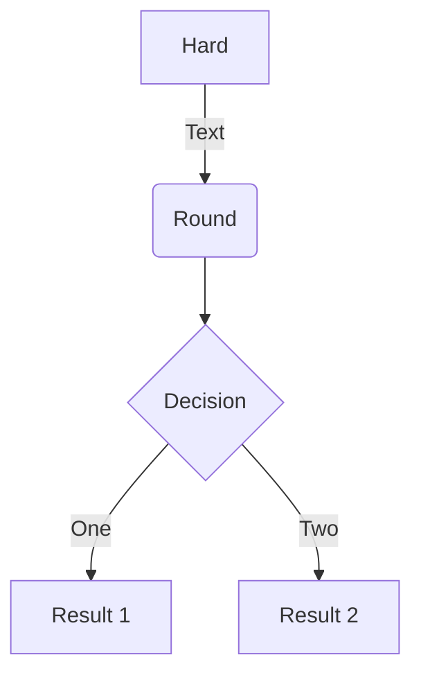
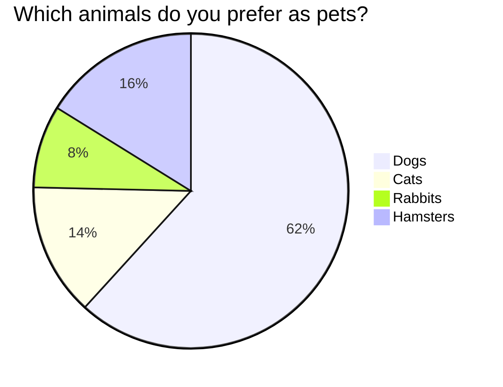
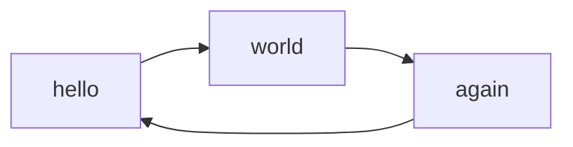
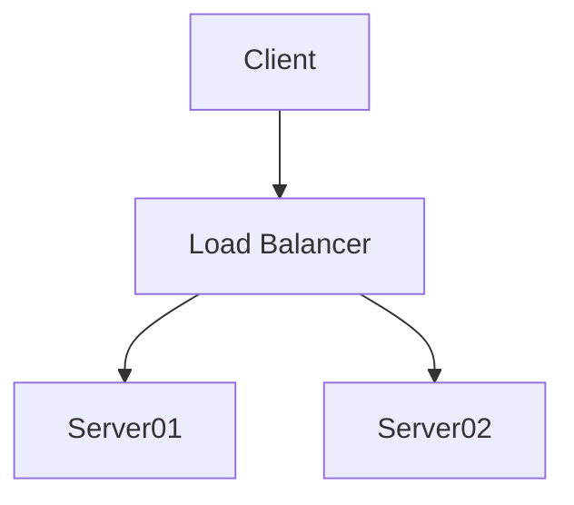
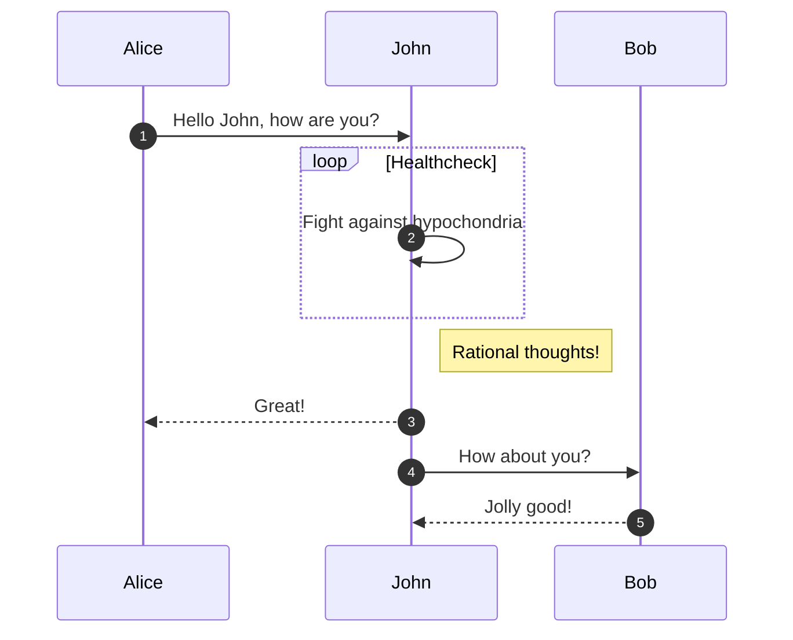
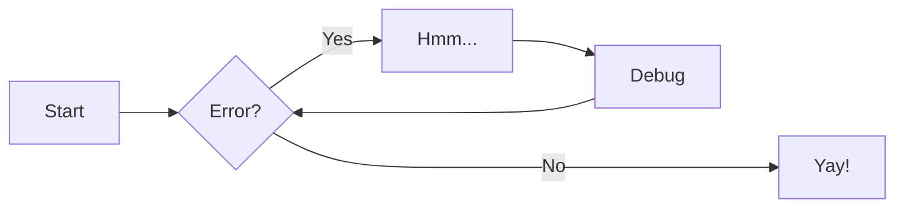

# 2024

<div class="parallax-bg"></div>


=== "TensorFlow Code"
    ```py
    import tensorflow as tf
    ```

=== "Bubble Sort Code"
    ```py title="bubble_sort.py"
    def bubble_sort(items):
        for i in range(len(items)):
            for j in range(len(items) - 1 - i):
                if items[j] > items[j + 1]:
                    items[j], items[j + 1] = items[j + 1], items[j]
    ```


``` yaml
theme:
  features:
    - content.code.annotate # (1)
```

1.  :man_raising_hand: I'm a code annotation! I can contain `code`, __formatted
    text__, images, ... basically anything that can be written in Markdown.

``` py linenums="1"
def bubble_sort(items):
    for i in range(len(items)):
        for j in range(len(items) - 1 - i):
            if items[j] > items[j + 1]:
                items[j], items[j + 1] = items[j + 1], items[j]
```

``` py hl_lines="2 3"
def bubble_sort(items):
    for i in range(len(items)):
        for j in range(len(items) - 1 - i):
            if items[j] > items[j + 1]:
                items[j], items[j + 1] = items[j + 1], items[j]
```

The `#!python range()` function is used to generate a sequence of numbers.


Tasklist

-   [X] item 1
    *   [ ] item B
        +   [x] item a
  -   [ ] item b
     +   [x] item c
-   [ ] item 2


=== "Powershell"
    Markdown **content**.

    ``` yaml
    theme:
      features:
        - content.code.annotate # (1)
    ```

===+ "Select Me"
    + to force a table**content**.

    ``` yaml
    theme:
      themen:
        - material # (1)
    ```

=== "CSS"
    More Markdown **content**.

    ``` yaml
    theme:
      themen:
        - material # (1)
    ```


[=75% "75%"]
[=20% "20%"]
[=25% "25%"]
[=45% "45%"]
[=65% "65%"]
[=85% "85%"]
[=100% "100%"]

[=85% "Installing..."]{: .candystripe}


++ctrl+alt+"My Special Key"++

++cmd+alt+"&Uuml;"++

https://facelessuser.github.io/pymdown-extensions/extensions/keys/

Here is some code: `#!py3 import pymdownx; pymdownx.__version__`.

1)  Item 1
2)  Item 2
    i.  Item 1
    ii. Item 2
        a.  Item a
        b.  Item b
            #.  Item 1
            #.  Item 2

-   Item 1
-   Item 2
1.  Item 1
2.  Item 2


??? multiple optional-class "Summary"
    Here's some content.

???+ note "Open styled details"

    ??? danger "Nested details!"
        And more content again.

??? success "¡Éxito!"
    Todo ha funcionado correctamente.

??? warning "Atención"
    Esto podría causar un problema si no se configura bien.

??? info "Información"
    Aquí va información útil.

| Method      | Description                          |
| :---------: | :----------------------------------: |
| `GET`       | :material-check:     Fetch resource  |
| `PUT`       | :material-check-all: Update resource |
| `DELETE`    | :material-close:     Delete resource |













{ align=left width=800 }
WARNING -  A reference to 'Windows/security.md' is included in the 'nav' configuration, which is not found in the documentation files.
WARNING -  A reference to 'problemas/windows.md' is included in the 'nav' configuration, which is not found in the documentation files.
WARNING -  A reference to 'problemas/linux.md' is included in the 'nav' configuration, which is not found in the documentation files.
WARNING -  A reference to 'problemas/codigo.md' is included in the 'nav' configuration, which is not found in the documentation files.
<br>
<br>
<br>
<br>
<br>
<br>
<br>
<br>
hola
<br>
<br>
<br>
<br>
<br>
<br>
<br>
<br>
<br>
<br>
<figure markdown="span">
  { width="700" }
  <figcaption>Hacker Angrif</figcaption>
</figure>

`Lorem ipsum dolor sit amet`

:   Sed sagittis eleifend rutrum. Donec vitae suscipit est. Nullam tempus
    tellus non sem sollicitudin, quis rutrum leo facilisis.

`Cras arcu libero`

:   Aliquam metus eros, pretium sed nulla venenatis, faucibus auctor ex. Proin
    ut eros sed sapien ullamcorper consequat. Nunc ligula ante.

    Duis mollis est eget nibh volutpat, fermentum aliquet dui mollis.
    Nam vulputate tincidunt fringilla.
    Nullam dignissim ultrices urna non auctor.

<span class="emoji" style="font-size: 2em;">:simple-sqlite:</span>

<span class="emoji" style="font-size: 2em;">:fontawesome-brands-windows:</span>
<span class="emoji" style="font-size: 2em;">:fontawesome-brands-linux:</span>
<span class="emoji" style="font-size: 2em;">:octicons-code-16:</span>
